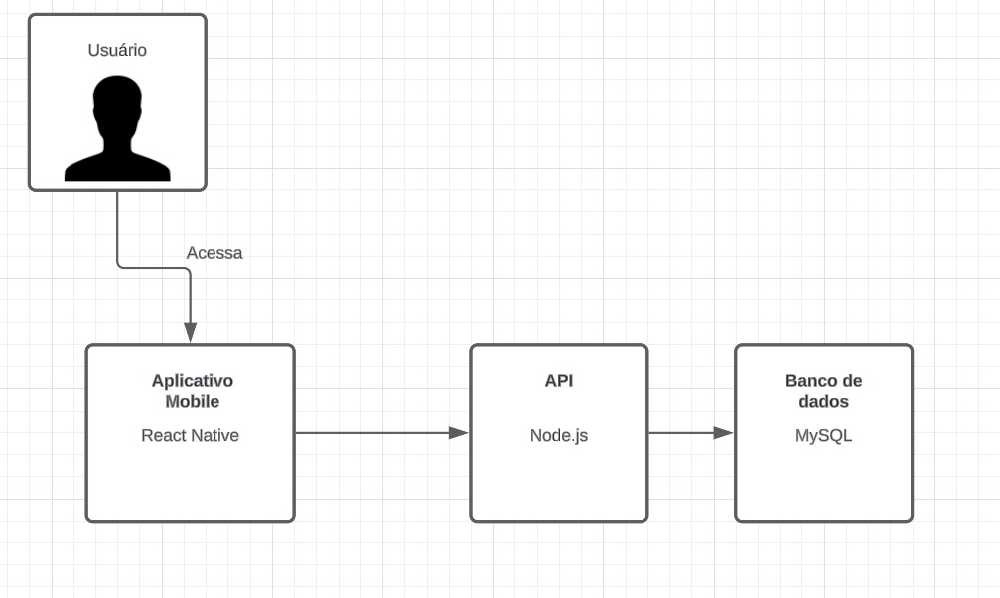

# encontro-segueme - Aplicativo Mobile

## Descrição do Aplicativo

O arquivo `descricao-telas.docx` contém descrições detalhadas e capturas de tela das interfaces criadas no Figma.

[Baixar descricao-telas.docx](./descricao-telas.docx)

## Diagrama UML

Abaixo está o diagrama UML que descreve a arquitetura básica do aplicativo:

